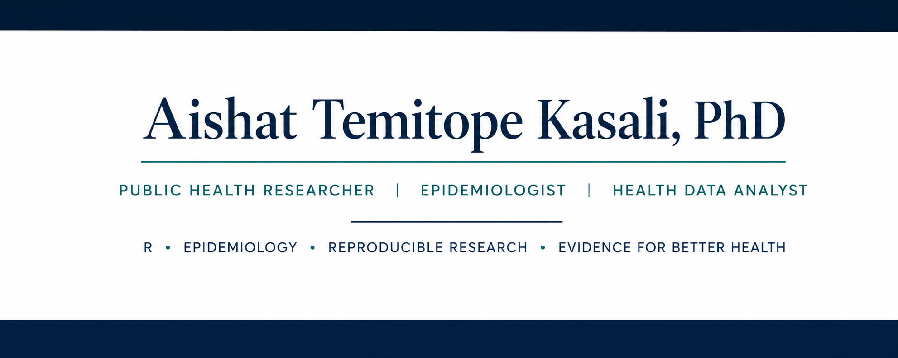

  

# Hi, I'm Aishat Temitope Kasali 

## Public Health Researcher | Epidemiologist | Data Analyst

I am a Public Health researcher with experience in epidemiology, reproductive health, and health data analysis. I use R to conduct reproducible statistical analyses and develop data-driven insights that support evidence-based public health decision-making.

---

## Research Interests

- Epidemiology
- Reproductive Health
- Global Health
- Maternal and Child Health
- Health Data Science
- Statistical Modelling
- Public Health Surveillance

---

## Technical Skills

### Statistical Software

- R
- SPSS
- Microsoft Excel

### R Packages

- dplyr
- ggplot2
- gtsummary
- broom
- flextable
- pROC
- car

### Data Analysis

- Data Cleaning
- Data Management
- Descriptive Statistics
- Logistic Regression
- Model Diagnostics
- Reproducible Research

---

## Featured Projects

### BRFSS 2015 Diabetes Risk Analysis

An end-to-end epidemiologic analysis of the CDC BRFSS dataset using R.

Skills demonstrated:

- Data Import
- Data Cleaning
- Logistic Regression
- Model Diagnostics
- Publication-ready Tables
- Git Version Control

Repository:

https://github.com/AishaKs18/brfss-2015-diabetes-risk-analysis

---

## Education

PhD Public Health

MSc Public Health

BSc Microbiology

---

## Connect with Me

GitHub:
https://github.com/AishaKs18
